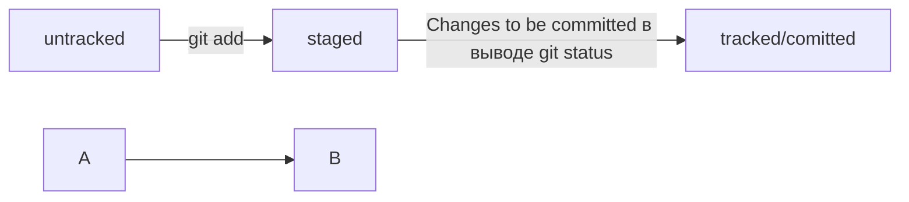

#Git команды 
* **git init** - _делает текущую папку репозиторием git_ 
_ **rm -rf .git** - _разгитить репозиторий, где -r рекурсивное удаление и -f принудительно_  

* **git status** - _инфо о статусе файлов в репозитории_  

* **git add** - _+ имя файла = подготовка файла к коммиту_  

* **git add --all** - _подготовка всех файлов репозитория к коммиту_  

* **git commit** - _закоммитить_  

* **git log** - _просмотр истории коммитов_  

* **git clone** - _+ x ссылка репозитория = копирует репозитория с GitHub на локальный ПК_  

* **git push** - _отправить кормит в удаленный репозиторий_  

* **git remote -v** - _убедиться в связке с удаленным репозиторием_  

* **git remote add origin** - _+ git@github.com + ссылка с GitHub_  

